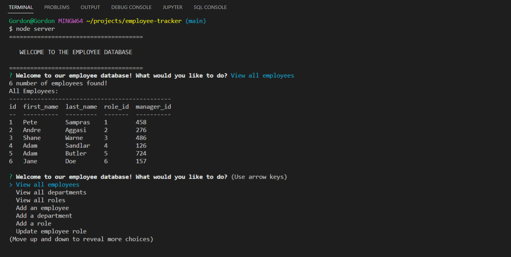

# employee-tracker

## ## Description
This is a CLI command-line application to manage a company's employee database, using Node.js, Inquirer, and MySQL2. This app was created to help a business owner or a administrator to maintain their team of employees. The user would interact with this app through the terminal, the user will able to navigate on what to do in the terminal. The user can add, delete, create, move, and manage the crucial and sensitive information about their emmployees. Such data like employee id, salary, mangaer number and full name is part of the data that is able to be displayed and manipulated in this app. 


### Liscence 

[](https://opensource.org/licenses/MIT)

### Installation

```md
- console.table
- dotenv
- express
- inquirer
- mysql
- myq12
- sequalize
- util
- node.js
```

### Links


### Live demo


### Screen shot


### Acceptance Criteria

```md
GIVEN a command-line application that accepts user input
WHEN I start the application
THEN I am presented with the following options: view all departments, view all roles, view all employees, add a department, add a role, add an employee, and update an employee role
WHEN I choose to view all departments
THEN I am presented with a formatted table showing department names and department ids
WHEN I choose to view all roles
THEN I am presented with the job title, role id, the department that role belongs to, and the salary for that role
WHEN I choose to view all employees
THEN I am presented with a formatted table showing employee data, including employee ids, first names, last names, job titles, departments, salaries, and managers that the employees report to
WHEN I choose to add a department
THEN I am prompted to enter the name of the department and that department is added to the database
WHEN I choose to add a role
THEN I am prompted to enter the name, salary, and department for the role and that role is added to the database
WHEN I choose to add an employee
THEN I am prompted to enter the employee’s first name, last name, role, and manager, and that employee is added to the database
WHEN I choose to update an employee role
THEN I am prompted to select an employee to update and their new role and this information is updated in the database 
```
### Questions 
If you have questions feel free to contact me at
- Gordon Driane email: gordon.draine97@yahoo.com
- 
- 


